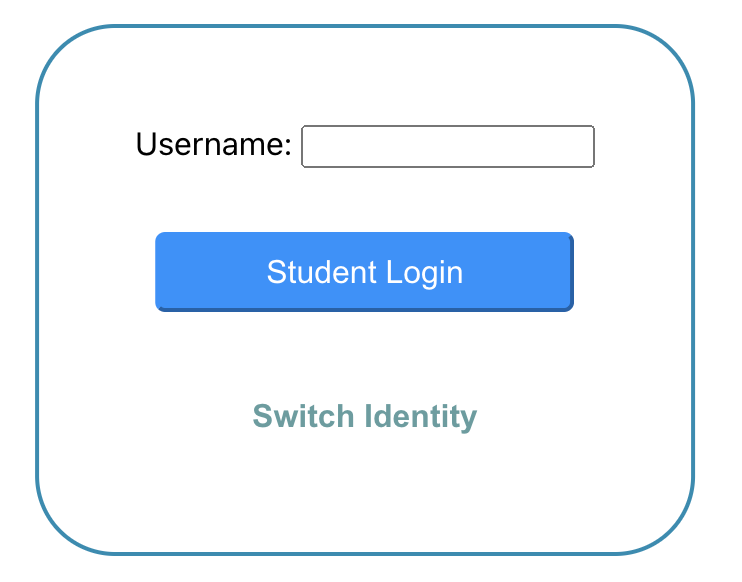
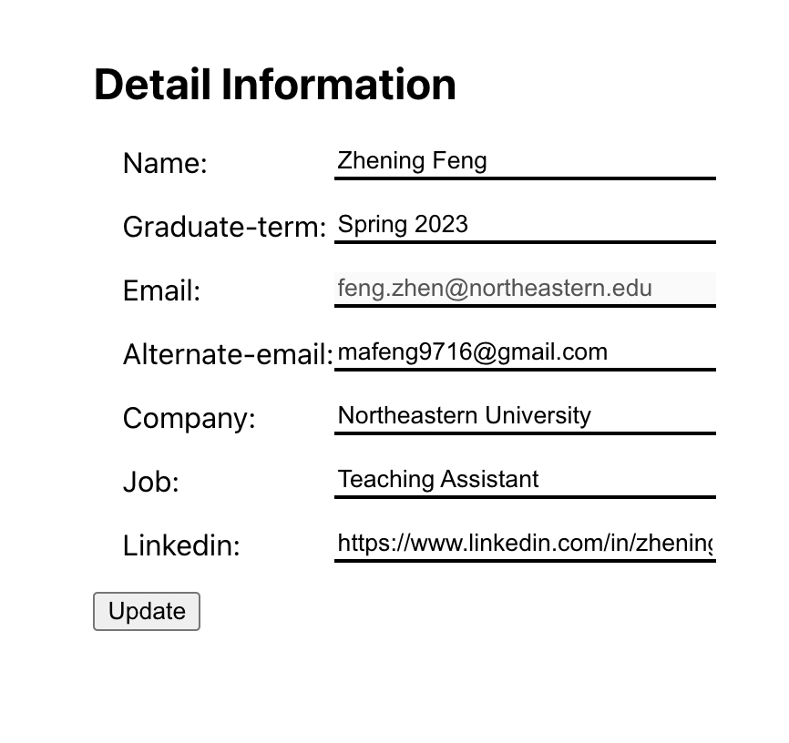
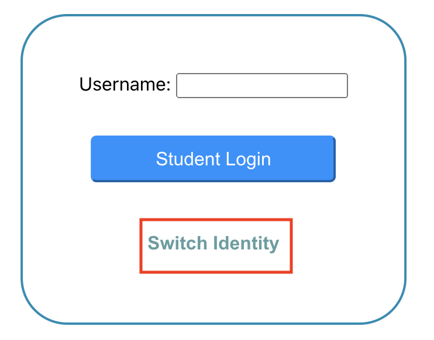
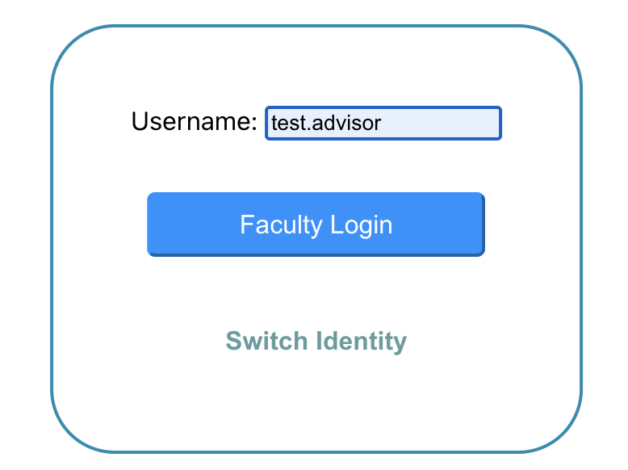
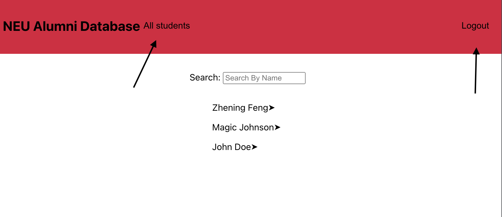
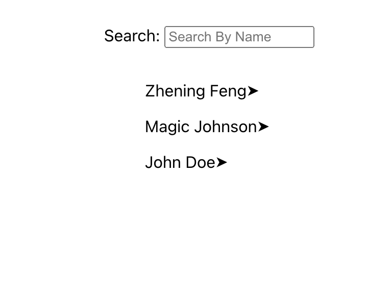
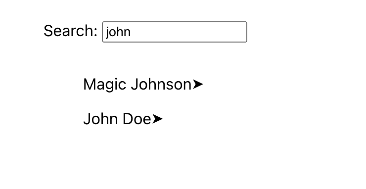

# NEU Alumni Collector Info(Local Server, DBless)
## Introduction
This is a SPA that is used to collect NEU alumni's information after graduation. Both students and advisors/faculties are allowed to use. Students will be able to login with their NEU account(xxx.xxx) and then edit the information(e.g. alternate email, job status, etc). Advisors/Faculties will also be able to login with their NEU account and view the stored information of users who have already submitted/updated their information.
## Available Scripts
In the project directory, you can run the app by:

### `npm start`
This script will run "npm run build" and "npm server.js" on localhost:3000

Runs the app in the production mode.\
Open [http://localhost:3000](http://localhost:3000) to view it in your browser.

### `npm test`

Launches the test runner in the interactive watch mode.\
See the section about [running tests](https://facebook.github.io/create-react-app/docs/running-tests) for more information.

### `npm run build`

Builds the app for production to the `build` folder.\
It correctly bundles React in production mode and optimizes the build for the best performance.

The build is minified and the filenames include the hashes.\
Your app is ready to be deployed!

See the section about [deployment](https://facebook.github.io/create-react-app/docs/deployment) for more information.

### `npm run start-dev`

Runs the app in the development mode.\
Open [http://localhost:3000](http://localhost:3000) to view it in your browser.\

The page will reload when you make changes.\
You may also see any lint errors in the console.\

### `npm run eject`

**Note: this is a one-way operation. Once you `eject`, you can't go back!**

If you aren't satisfied with the build tool and configuration choices, you can `eject` at any time. This command will remove the single build dependency from your project.

Instead, it will copy all the configuration files and the transitive dependencies (webpack, Babel, ESLint, etc) right into your project so you have full control over them. All of the commands except `eject` will still work, but they will point to the copied scripts so you can tweak them. At this point you're on your own.

You don't have to ever use `eject`. The curated feature set is suitable for small and middle deployments, and you shouldn't feel obligated to use this feature. However we understand that this tool wouldn't be useful if you couldn't customize it when you are ready for it.

## Usage of NEU Alumni Collector
---
Run "npm start" at the root level of project.\

### Student Login and View
For student login, enter your neu username (xxx.xxx) into the username form and click "Student Login". This will register a new student in students.\
Or, enter "feng.zhen", "magic.j", and "john.d" in username to see the sample of stored existing form.\


Leaving the username blank or invalid neu username will result in error.\

**Username Exception: dog.dog will be considered as a weak-authentication option and will result in error.**

After login, you should be able to see a empty and editable form which includes information collected.\
The email is considered to be preassigned. We use neu username + @northeastern.edu template and is not allowed to change.\
Edit your information and click on "Update" below to store your save.\
**NOTE: Name is required when updating this form.**\



### Faculty Login and View
For faculty login, click on the button below "Switch Identity" to switch button to "Faculty Login".\


Currently, please use "test.advisor" to login as test faculty.\
**The app does not support registration of Faculty role now.**\



After login, click on the username in the list to see detail information of that user. However, as a faculty, you cannot edit the information.\
Click the "All students" button in header to go back to the list.\



Type in the "Search" to filter the students by their name.\


### Logout
Click the Logout button on the top-right corner to logout

## APIs
---
### Get Current Session
`GET` /api/v1/session
* **URL params**
    None
* **Success Response**
* * **Code:** 200 <br />
    **Content:** `{"username" : string, id:uuid, "authority":string}`

* **Error Response:**

  * **Code:** 401 UNAUTHORIZED <br />
    **Content:** `{ error : "auth-missing" }`

* **Sample Call:**

  ``` 
  fetch(("/api/v1/session"),{
        method:"GET",
        credentials: "include",
        headers:{
            content-type:"application/json"
        }
    });
  ```

### Create New User, login, and create cookie
`POST` /api/v1/session
* **URL params**
    None
* **Data params**
    **Required:**
   `username=[string]`

* **Success Response**
* * **Code:** 200 <br />
    **Content:** `{"username" : string, id:uuid, "authority":string}`

* **Error Response:**

  * **Code:** 400 Bad Request <br />
    **Content:** `{ error : "require-username" }`

    OR

  * **Code:** 400 Bad Request <br />
  **Content:** `{ error : "invalid-username" }`

    OR

  * **Code:** 403 Forbidden <br />
    **Content:** `{ error : "weak-auth", }`

    OR

  * **Code:** 405 Method Not Allowed <br />
  **Content:** `{ error : "duplicate-username" }`

* **Sample Call:**

  ``` 
  fetch(("/api/v1/session"),{
        method:"POST",
        credentials: "include",
        headers:{
            content-type:"application/json"
        },
        body:JSON.stringify({username})
    });
  ```
### Log user out and delete cookie
`DELETE` /api/v1/session
* **URL params**
    None
* **Data params**
    None
* **Success Response**
* * **Code:** 200 <br />
    **Content:** `{"wasLoggedIn": boolean}`

* **Error Response:**
    None
* **Sample Call:**

  ``` 
  fetch(("/api/v1/session"),{
        method:"DELETE",
        credentials: "include",
        headers:{
            content-type:"application/json"
        },
    });
  ```

### Get all students' information
`GET` /api/v1/students
* **URL params**
    None
* **Data params**
    None
* **Success Response**
* * **Code:** 200 <br />
    **Content:** 
    ```
    {student: 
        {
            information: {
            name: string,
            graduateTerm: string,
            neuEmail: string/email,
            alternateEmail: string/email,
            jobTitle: string,
            company: string,
            linkedinProfile: string,
            },
            authority: string,
        }
    }
    ```


* **Error Response:**

  * **Code:** 401 UNAUTHORIZED <br />
    **Content:** `{ error : "auth-missing" }`

    OR

* **Code:** 403 Forbidden <br />
    **Content:** `{ error : "unauthorized-identity"}`

* **Sample Call:**

  ``` 
  fetch(("/api/v1/students"),{
        method:"GET",
        credentials: "include",
        headers:{
            content-type:"application/json"
        }
    });
  ```
### Get Student information by id
`GET` /api/v1/students/:id
* **URL params**
    id=[uuid]
* **Data params**
    None
* **Success Response**
* * **Code:** 200 <br />
    **Content:** 
    ```
    {
        "student":{
            information: {
            name: string,
            graduateTerm: string,
            neuEmail: `${username}@northeastern.edu`,
            alternateEmail: string,
            jobTitle: string,
            company: string,
            linkedinProfile: string,
            },
            authority: AUTHORITY["student"],
        }
    }
    ```
* **Error Response:**

  * **Code:** 401 UNAUTHORIZED <br />
    **Content:** `{ error : "auth-missing" }`

    OR

* **Code:** 404 Not Found <br />
    **Content:** `{ error : "student-not-found"}`

* **Sample Call:**

  ``` 
  fetch((`/api/v1/students/${id}`),{
        method:"GET",
        credentials: "include",
        headers:{
            content-type:"application/json"
        }
    });
  ```
### POST /api/v1/students/:id
**URL params**
    id=[uuid]
* **Data params**
    An Object
* **Success Response**
* * **Code:** 200 <br />
    **Content:** 
    ```
    {   
        "id" : [uuid]
        "student":{
            information: {
            name: string,
            graduateTerm: string,
            neuEmail: `${username}@northeastern.edu`,
            alternateEmail: string,
            jobTitle: string,
            company: string,
            linkedinProfile: string,
            },
            authority: AUTHORITY["student"],
        }
    }
    ```
* **Error Response:**

  * **Code:** 401 Unauthorized <br />
    **Content:** `{ error : "auth-missing" }`

    OR

* **Code:** 404 Not Found <br />
    **Content:** `{ error : "student-not-found"}`

    OR

* **Code:** 400 Bad Request <br />
**Content:** `{ error : "invalid-request"}`

    OR

* **Code:** 400 Bad Request <br />
    **Content:** `{ error :"missing-fields"}`

* **Sample Call:**

  ``` 
  fetch((`/api/v1/students/${id}`),{
        method:"GET",
        credentials: "include",
        headers:{
            content-type:"application/json"
        }
    });
  ```
### DELETE /api/v1/students/:id
**URL params**
    id=[uuid]
* **Data params**
    None
* **Success Response**
* * **Code:** 200 <br />
    **Content:** 
    ```
    {
        deleted: uuid
    }
    ```
* **Error Response:**

  * **Code:** 401 UNAUTHORIZED <br />
    **Content:** `{ error : "auth-missing" }`

    OR

* **Code:** 404 Not Found <br />
    **Content:** `{ error : "student-not-found"}`

* **Sample Call:**

  ``` 
  fetch((`/api/v1/students/${id}`),{
        method:"DELETE",
        credentials: "include",
        headers:{
            content-type:"application/json"
        }
    });
  ```
